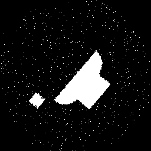

**Edge and Feature-based Object Recognition Competition**

***M. Belal ALKASSAB***

## 1. Introduction

> This is a mini project for CMP5550 class, the aim of this project is
> to apply edge detection and feature extraction techniques for object
> recognition, the [dataset](https://drive.google.com/drive/folders/1ez89RGBRGuNp-U0bL8D4NJxV5yylF5Ob?usp=drive_link) is a collection of images of 5 different
> abstract shapes with high amount of artificial colored salt-and-pepper
> noise.
>
> The code was written in Matlab and multiple feature detection methods
> were tested to find an optimal algorithm for feature detection and
> matching.

## 2. Methodology

### 2.1 Data Preprocessing

The images were converted into grayscale, then converted into binary
black and white images using the "imbinarize" function with three
different levels of luminance thresholds. Holes in the binary images were filled.

  
*Original Input Image (left) and Partially Preprocessed Image (right)*

As seen above, small noise-induced dots smaller than 4 pixels were removed using `bwareaopen`.

  
*Final Preprocessed Image*

Then, adaptive filtering was used based on shape region counts.

  
*Example showing how a very noisy image can lose its features after preprocessing with a low binarization threshold*

After that, only the largest 3 regions were kept.

  
*Better Binarization Threshold and Final Result*

### 2.2 Edge Detection

"Sobel" edge detection algorithm was used.

It performed better and was faster than "Canny".

  
*Sobel Edge Detection Result*

### 2.3 Feature Detection and Extraction

> The following methods were tested: ORB, SIFT, KAZE, SURF, FAST, BRISK, and Harris.  
> ORB reached ~70%, and KAZE performed best at ~80% accuracy.

  
*Examples of the features detected using KAZE algorithm*

### 2.4 Feature Matching

> Matlab’s `matchFeatures` function was used with "Unique=true" and "Exhaustive" method.  
> SSD metric and a custom thresholding were applied.

- Cutoff = 0.028
- Min matches = 7

  
*Example of a correct feature matching result*

  
*Example of an incorrect feature matching result*

## 3. Metrics and Outcomes

### 3.1 Metrics Calculation Method

> Matching was evaluated as true/false positives/negatives based on shape similarity.

### 3.2 Accuracy, Precision and Recall

|              | Circle | Heart | Square | Star  | Triangle |
|--------------|--------|-------|--------|-------|----------|
| **Circle**   | 94.58% | 98.08%| 99.15% | 97.45%| 99.01%   |
| **Heart**    |   -    | 76.69%| 86.63% | 91.18%| 78.83%   |
| **Square**   |   -    |   -   | 75.28% | 91.19%| 87.43%   |
| **Star**     |   -    |   -   |   -    | 76.88%| 4.58%    |
| **Triangle** |   -    |   -   |   -    |   -   | 98.34%   |

> **Accuracy = 84.33%**  
> **Precision = 74.14%**  
> **Recall = 84.1%**

## 4. Observations

Triangle and star shapes had poor match performance.

  
*Example of a very noisy star image that failed matching*

The star often resembles a triangle due to overlapping outlines.

  
*Example of a noisy star image (left) and a noisy triangle image (right)*

## 5. Future Work

- Improved adaptive preprocessing
- Using different feature detector/extractor pairs (e.g., KAZE + ORB)
- RANSAC for outlier rejection to eliminate small square shapes and noise-induced false matches
